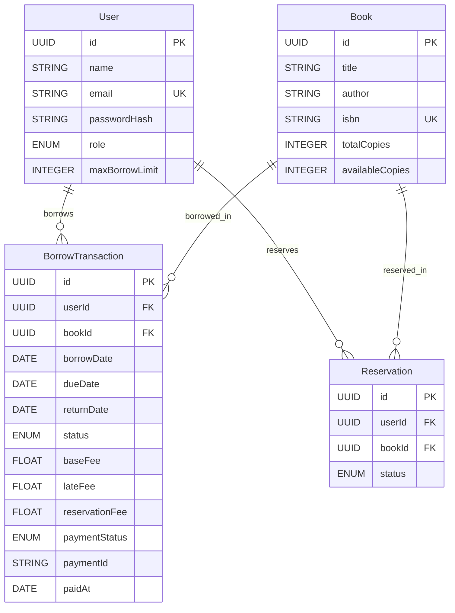

# Database Entity Relationship Diagram (ERD)

## Overview

This document provides a comprehensive Entity Relationship Diagram (ERD) for the Library Management System database, detailing all entities, their attributes, and the relationships between them.

## Entity Relationship Diagram

## Entity Descriptions

### User Entity

The User entity represents all users in the system, including students, faculty members, and librarians.

**Attributes:**

- `id` (UUID, Primary Key): Unique identifier for each user
- `name` (STRING, Not Null): Full name of the user
- `email` (STRING, Unique, Not Null): Email address used for authentication
- `passwordHash` (STRING, Not Null): Hashed password using bcrypt
- `role` (ENUM, Not Null): User role - STUDENT, FACULTY, or LIBRARIAN
- `maxBorrowLimit` (INTEGER, Default: 3): Maximum number of books the user can borrow simultaneously

**Business Rules:**

- Email must be unique across all users
- Role determines borrow limit: STUDENT (3), FACULTY (5), LIBRARIAN (10)
- Password is stored as a hash, never in plain text

### Book Entity

The Book entity represents books in the library catalogue.

**Attributes:**

- `id` (UUID, Primary Key): Unique identifier for each book
- `title` (STRING, Not Null): Title of the book
- `author` (STRING, Not Null): Author of the book
- `isbn` (STRING, Unique, Not Null): International Standard Book Number
- `totalCopies` (INTEGER, Default: 1): Total number of copies owned by the library
- `availableCopies` (INTEGER, Default: 1): Number of copies currently available for borrowing

**Business Rules:**

- ISBN must be unique across all books
- `availableCopies` cannot exceed `totalCopies`
- `availableCopies` is automatically decremented when a book is borrowed
- `availableCopies` is automatically incremented when a book is returned

### BorrowTransaction Entity

The BorrowTransaction entity tracks all borrowing and returning operations in the system.

**Attributes:**

- `id` (UUID, Primary Key): Unique identifier for each transaction
- `userId` (UUID, Foreign Key): Reference to the user who borrowed the book
- `bookId` (UUID, Foreign Key): Reference to the borrowed book
- `borrowDate` (DATE, Not Null): Date and time when the book was borrowed
- `dueDate` (DATE, Not Null): Date and time when the book is due for return
- `returnDate` (DATE, Nullable): Date and time when the book was returned (null if not yet returned)
- `status` (ENUM, Default: BORROWED): Transaction status - BORROWED, RETURNED, or OVERDUE
- `baseFee` (FLOAT, Default: 0): Base fee for the transaction
- `lateFee` (FLOAT, Default: 0): Late fee charged for overdue returns
- `reservationFee` (FLOAT, Default: 0): Reservation fee if book had pending reservations
- `paymentStatus` (ENUM, Default: PENDING): Payment status - PENDING, PAID, or FAILED
- `paymentId` (STRING, Nullable): Stripe payment session ID
- `paidAt` (DATE, Nullable): Date and time when fees were paid

**Business Rules:**

- `dueDate` is automatically set to 14 days after `borrowDate`
- `returnDate` is null until the book is returned
- `status` is BORROWED until return, then changes to RETURNED
- Fees are calculated automatically upon return using Decorator pattern
- Payment status tracks whether fees have been paid via Stripe

### Reservation Entity

The Reservation entity tracks book reservation requests from users.

**Attributes:**

- `id` (UUID, Primary Key): Unique identifier for each reservation
- `userId` (UUID, Foreign Key): Reference to the user making the reservation
- `bookId` (UUID, Foreign Key): Reference to the reserved book
- `status` (ENUM, Default: PENDING): Reservation status - PENDING, NOTIFIED, or CANCELLED

**Business Rules:**

- Reservations are processed in FIFO (First In, First Out) order
- Status changes to NOTIFIED when the book becomes available
- Used by Observer pattern to notify waiting users

## Relationship Descriptions

### User to BorrowTransaction (One-to-Many)

**Relationship Type:** One-to-Many

**Cardinality:** One User can have many BorrowTransactions

**Foreign Key:** `BorrowTransaction.userId` references `User.id`

**Description:**

- Each user can have multiple borrow transactions over time
- A borrow transaction belongs to exactly one user
- When a user is deleted, their borrow transactions may be handled according to business rules (cascade or restrict)

**Business Logic:**

- Used to track a user's borrowing history
- Enables calculation of current borrowed count for limit enforcement
- Supports librarian view of all transactions by user

### Book to BorrowTransaction (One-to-Many)

**Relationship Type:** One-to-Many

**Cardinality:** One Book can have many BorrowTransactions

**Foreign Key:** `BorrowTransaction.bookId` references `Book.id`

**Description:**

- A book can be borrowed multiple times by different users over time
- Each borrow transaction is associated with exactly one book
- Multiple active transactions can exist for the same book if multiple copies are available

**Business Logic:**

- Tracks borrowing history for each book
- Enables calculation of availability based on active borrows
- Supports tracking of book usage statistics

### User to Reservation (One-to-Many)

**Relationship Type:** One-to-Many

**Cardinality:** One User can have many Reservations

**Foreign Key:** `Reservation.userId` references `User.id`

**Description:**

- A user can reserve multiple books simultaneously
- Each reservation belongs to exactly one user
- Supports waitlist functionality when books are unavailable

**Business Logic:**

- Enables users to be notified when reserved books become available
- Supports FIFO queue management for reservations
- Used by WaitlistObserver in Observer pattern implementation

### Book to Reservation (One-to-Many)

**Relationship Type:** One-to-Many

**Cardinality:** One Book can have many Reservations

**Foreign Key:** `Reservation.bookId` references `Book.id`

**Description:**

- A book can have multiple pending reservations from different users
- Each reservation is for exactly one book
- Reservations are processed in order of creation (FIFO)

**Business Logic:**

- Enables waitlist management for popular books
- Triggers notification system when book becomes available
- Used to calculate reservation fees when book is returned

## Relationship Constraints

### Foreign Key Constraints

All foreign key relationships enforce referential integrity:

1. **BorrowTransaction.userId** → **User.id**

   - Ensures every borrow transaction has a valid user
   - Prevents orphaned transactions

2. **BorrowTransaction.bookId** → **Book.id**

   - Ensures every borrow transaction has a valid book
   - Prevents transactions for non-existent books

3. **Reservation.userId** → **User.id**

   - Ensures every reservation has a valid user
   - Maintains data integrity for waitlist

4. **Reservation.bookId** → **Book.id**
   - Ensures every reservation has a valid book
   - Prevents reservations for non-existent books

### Unique Constraints

1. **User.email**: Ensures email uniqueness for authentication
2. **Book.isbn**: Ensures ISBN uniqueness to prevent duplicate book entries

### Check Constraints (Business Logic)

1. **Book.availableCopies ≤ Book.totalCopies**: Enforced at application level
2. **BorrowTransaction.dueDate > BorrowTransaction.borrowDate**: Enforced at application level
3. **BorrowTransaction.returnDate ≥ BorrowTransaction.borrowDate**: Enforced at application level

## Data Flow Through Relationships

### Borrowing Flow

1. User requests to borrow a Book
2. System creates BorrowTransaction with:
   - `userId` → links to User
   - `bookId` → links to Book
   - `borrowDate` → current date
   - `dueDate` → borrowDate + 14 days
3. Book.availableCopies is decremented
4. Transaction status set to BORROWED

### Returning Flow

1. User returns a Book
2. System updates BorrowTransaction:
   - `returnDate` → current date
   - `status` → RETURNED
   - Fees calculated and stored
3. Book.availableCopies is incremented
4. If reservations exist, next user is notified via Reservation relationship

### Reservation Flow

1. User reserves unavailable Book
2. System creates Reservation with:
   - `userId` → links to User
   - `bookId` → links to Book
   - `status` → PENDING
3. When Book becomes available:
   - First PENDING reservation is processed
   - Reservation.status → NOTIFIED
   - User is notified via NotificationService

## Indexes

For optimal query performance, the following indexes are recommended:

1. **User.email**: Unique index (automatically created by unique constraint)
2. **Book.isbn**: Unique index (automatically created by unique constraint)
3. **BorrowTransaction.userId**: Index for user transaction queries
4. **BorrowTransaction.bookId**: Index for book transaction queries
5. **BorrowTransaction.status**: Index for filtering active borrows
6. **Reservation.bookId + status**: Composite index for reservation queue queries
7. **Reservation.userId**: Index for user reservation queries

## Summary

The database schema consists of four main entities with clear relationships:

- **User**: Central entity representing all system users
- **Book**: Represents library inventory
- **BorrowTransaction**: Tracks all borrowing operations and fees
- **Reservation**: Manages waitlist for unavailable books

The relationships support:

- User borrowing history tracking
- Book availability management
- Fee calculation and payment tracking
- Waitlist and notification system
- Comprehensive audit trail of all library operations

All relationships maintain referential integrity through foreign key constraints, ensuring data consistency and preventing orphaned records.
