# Library Management System - System Architecture and Flow Documentation

## Overview

This document provides a comprehensive overview of the Library Management System architecture, including system flow diagrams, component interactions, and the integration between frontend and backend systems.

## System Architecture

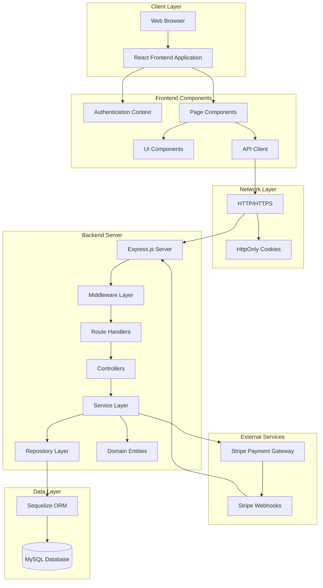

## Architecture Layers

### 1. Client Layer (Frontend)

**Technology Stack:**

- React 18+ with functional components and hooks
- React Router for navigation
- Context API for state management
- Axios/Fetch for HTTP requests

**Key Components:**

- **Authentication Context**: Manages user authentication state
- **Page Components**: Dashboard, Books, Transactions, Profile, Members
- **UI Components**: Reusable components (Table, Card, Input, Modal, etc.)
- **API Client**: Centralized API request handler with error management

### 2. Network Layer

**Communication Protocol:**

- HTTP/HTTPS for all API communications
- RESTful API design principles
- Cookie-based authentication (HttpOnly cookies)
- CORS configuration for cross-origin requests

**Security Features:**

- HttpOnly cookies prevent XSS attacks
- SameSite attribute provides CSRF protection
- Secure flag in production for HTTPS-only cookies

### 3. Backend Server Layer

**Technology Stack:**

- Node.js runtime environment
- Express.js web framework
- Cookie parser middleware
- CORS middleware

**Request Processing Flow:**

1. Request received by Express server
2. CORS middleware validates origin
3. Cookie parser extracts authentication cookies
4. JSON parser processes request body
5. Routes match request to appropriate handler
6. Authentication middleware verifies user
7. Controller processes business logic
8. Response sent back to client

### 4. Application Layer (MVC Architecture)

**Model Layer:**

- Sequelize ORM models (UserModel, BookModel, BorrowTransactionModel, ReservationModel, NotificationModel)
- Database schema definitions
- Model associations and relationships

**View Layer:**

- Not applicable (REST API architecture)
- Frontend handles all presentation

**Controller Layer:**

- AuthController: Authentication operations
- BookController: Book management
- BorrowController: Borrowing operations
- UserController: User profile management
- LibrarianController: Librarian-specific operations
- PaymentController: Payment processing
- ReservationController: Reservation management
- NotificationController: Notification management

### 5. Service Layer (Business Logic)

**Service Classes:**

- **AuthService**: User registration, login, token management
- **BookService**: Book CRUD operations, search functionality, reservation status checking
- **ReservationService**: Reservation creation, retrieval, cancellation
- **NotificationService**: Notification creation, retrieval, read status management
- **BorrowService**: Borrowing, returning, fee calculation, reservation queue management
- **UserService**: User management, profile updates
- **PaymentService**: Stripe integration, payment processing
- **FeeService**: Fee calculation using Decorator pattern

**Design Patterns Implementation:**

- **Factory Pattern**: UserFactory creates user instances
- **Singleton Pattern**: LibraryCatalogue maintains single instance
- **Observer Pattern**: BookReturnSubject with multiple observers
- **Decorator Pattern**: Fee calculation composition

### 6. Repository Layer (Data Access)

**Repository Classes:**

- **UserRepository**: User data access operations
- **BookRepository**: Book data access operations
- **BorrowTransactionRepository**: Transaction data access
- **ReservationRepository**: Reservation data access, queue management
- **NotificationRepository**: Notification data access, read status management

**Responsibilities:**

- Abstract database operations from business logic
- Convert database rows to domain entities
- Handle data persistence and retrieval
- Maintain separation of concerns

### 7. Domain Layer (Domain Entities)

**Entity Classes:**

- **User**: Base user entity with role-based subclasses
- **Book**: Book domain entity with availability logic
- **BorrowTransaction**: Transaction entity with business rules
- **LibraryCatalogue**: Singleton catalogue management

**Business Rules:**

- Encapsulated within domain entities
- Validation and state management
- Domain-specific methods and behaviors

### 8. Data Layer

**Database:**

- MySQL relational database
- Sequelize ORM for database abstraction
- Connection pooling for performance
- Transaction support for data integrity

**Database Operations:**

- Automatic schema synchronization (development)
- Migration support for production
- Foreign key constraints for referential integrity
- Indexes for query optimization

## Complete System Flow

### Authentication Flow

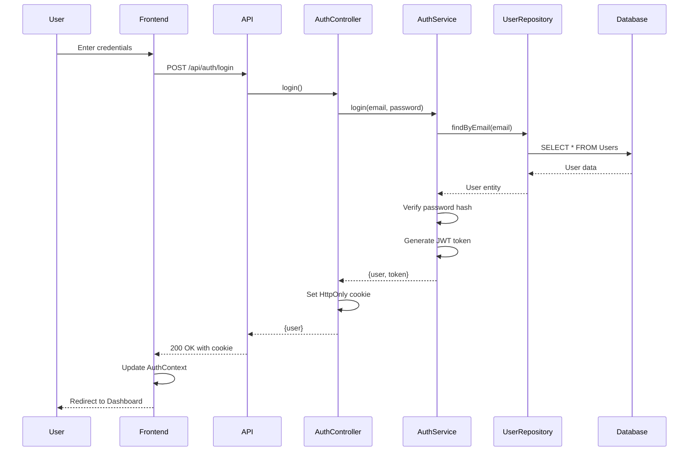

### Book Borrowing Flow

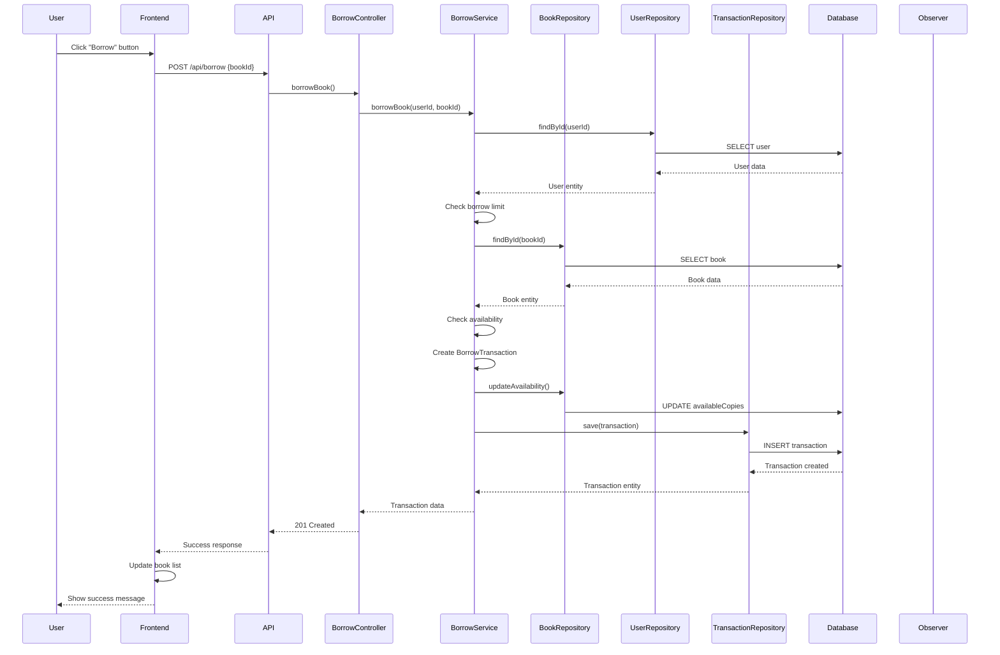

### Book Return Flow with Fee Calculation

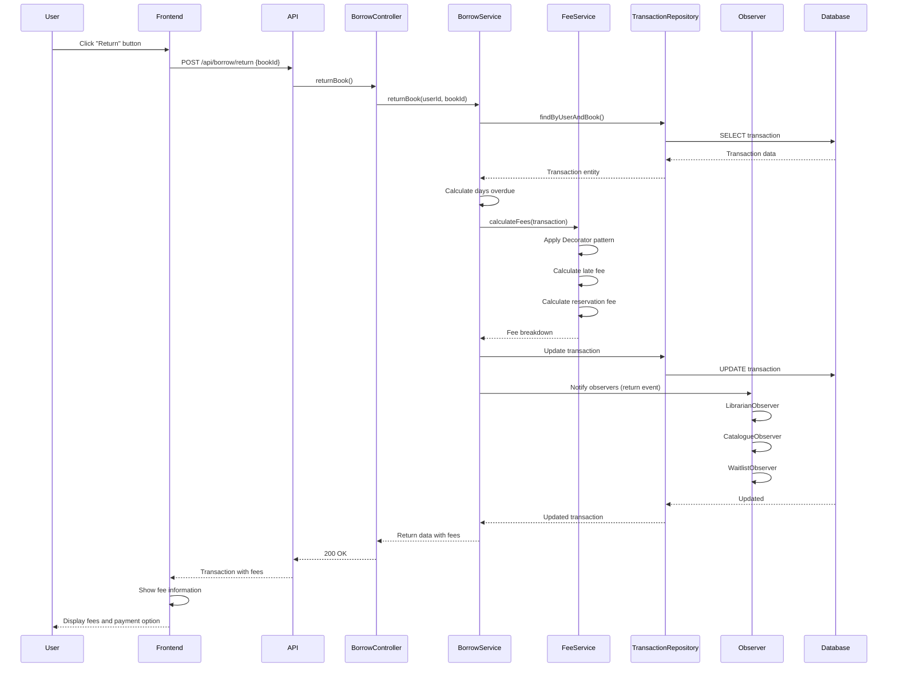

### Payment Processing Flow

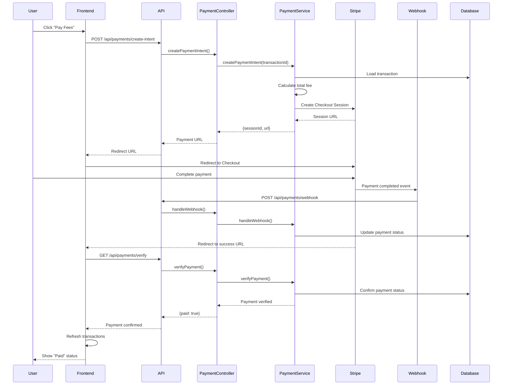

### Book Reservation Flow

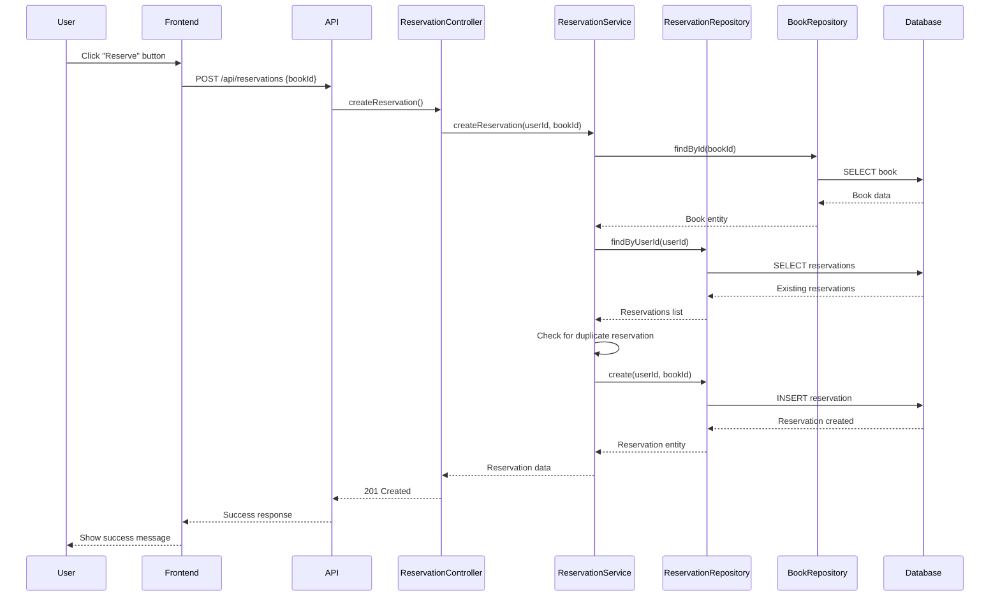

### Book Return with Reservation Notification Flow

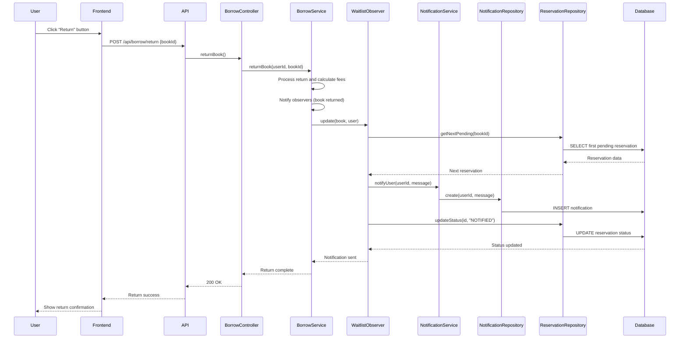

### Book Borrow with Reservation Queue Flow

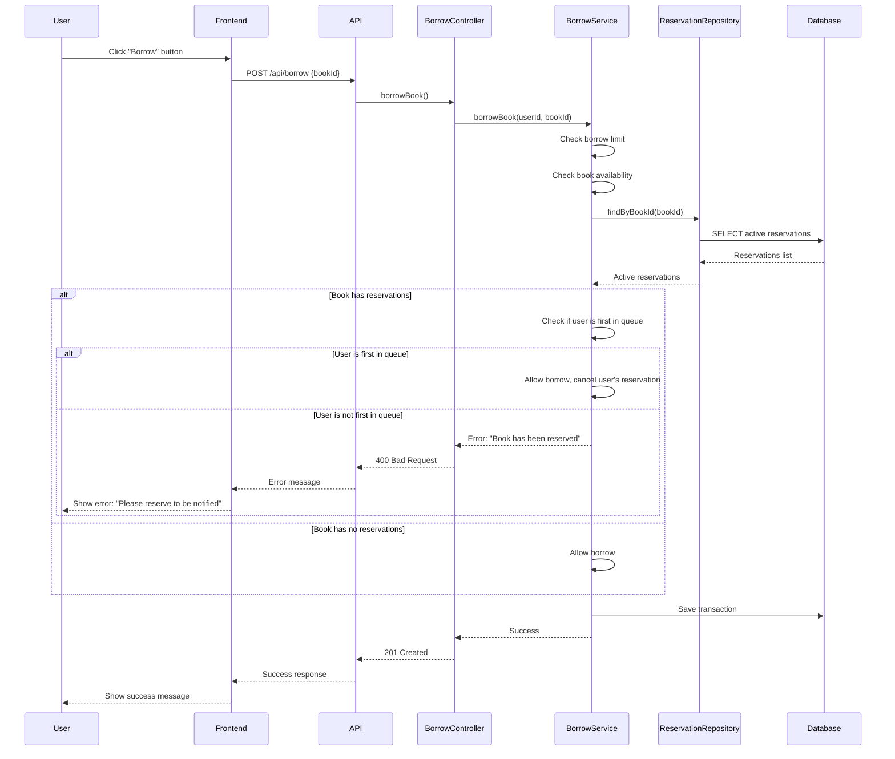

### Notification Retrieval Flow

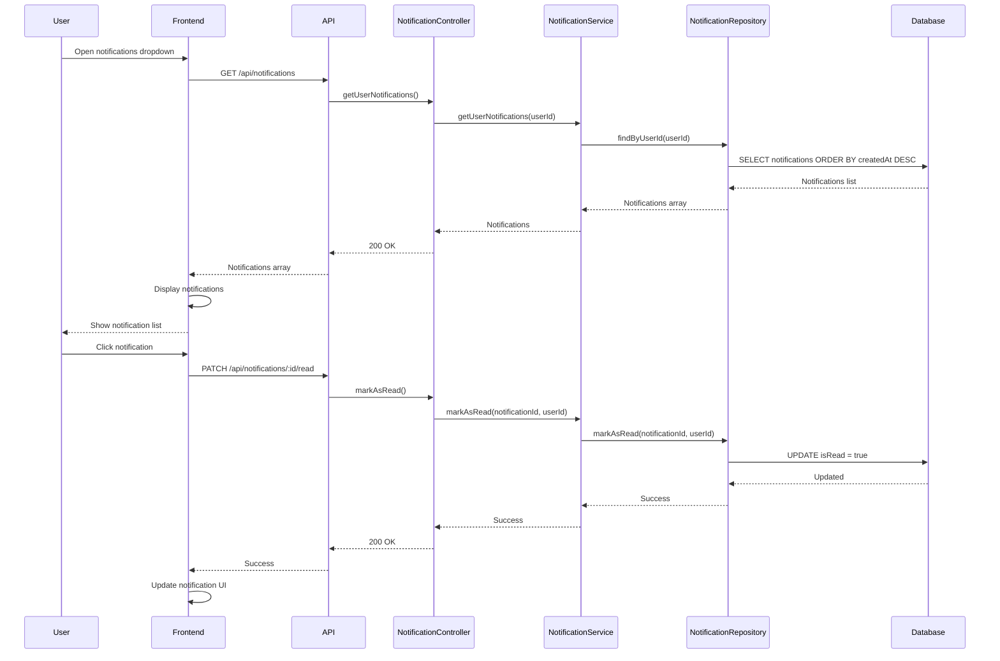

### Librarian User Management Flow

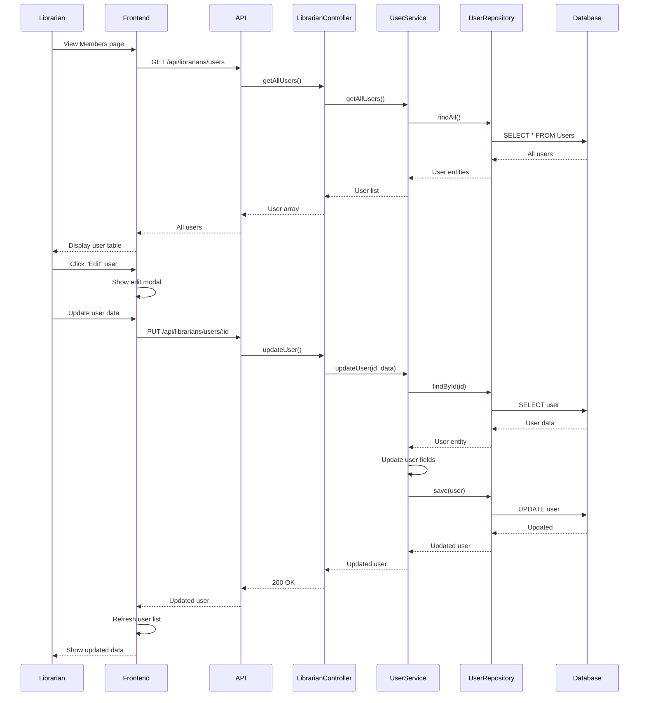

## Frontend-Backend Integration

### API Communication Pattern

**Request Flow:**

1. User interaction triggers frontend event handler
2. Frontend component calls API client function
3. API client constructs HTTP request with:
   - Endpoint URL
   - HTTP method (GET, POST, PUT, DELETE, PATCH)
   - Request body (if applicable)
   - Cookies automatically included (credentials: "include")
4. Request sent to backend API
5. Backend processes request through middleware and controllers
6. Response returned to frontend
7. Frontend updates UI based on response

**Error Handling:**

- API client catches HTTP errors
- Error messages displayed to user via toast notifications
- Network errors handled gracefully
- Authentication errors trigger logout and redirect

### State Management

**Authentication State:**

- Managed by AuthContext using React Context API
- User information stored in context
- Authentication status checked on app initialization
- Logout clears context and cookies

**Data State:**

- Component-level state using useState hook
- Data fetched on component mount using useEffect
- State updates trigger UI re-renders
- Optimistic updates for better UX

**Shared State:**

- MembersContext for librarian user management
- Shared across multiple components
- Centralized data fetching and caching

### Real-time Updates

**Transaction Status:**

- Frontend polls for payment status after redirect
- Webhook updates database asynchronously
- Frontend refreshes data to show latest status
- Multiple refresh attempts ensure consistency

**Book Availability:**

- Updated immediately after borrow/return operations
- Frontend optimistically updates UI
- Backend confirms actual availability
- Discrepancies resolved on next data fetch

**Notifications:**

- Frontend polls for new notifications every 30 seconds
- Unread count displayed in notification bell icon
- Notifications automatically created when reserved books become available
- Real-time updates when notifications are marked as read

**Reservations:**

- Reservation status updated in real-time
- Books with reservations show both Borrow and Reserve buttons
- Reservation queue enforced on backend (FIFO system)

## Security Architecture

### Authentication Security

**Cookie-Based Authentication:**

- HttpOnly flag prevents JavaScript access (XSS protection)
- SameSite attribute prevents CSRF attacks
- Secure flag in production (HTTPS only)
- Expiration set to match JWT token lifetime

**Token Security:**

- JWT tokens signed with secret key
- Token expiration enforced (7 days)
- Token verification on every protected request
- Invalid tokens trigger immediate logout

### Authorization Security

**Role-Based Access Control:**

- User role stored in JWT token
- Middleware checks role before route access
- Librarian-only endpoints protected
- User-specific data access enforced

**Data Access Control:**

- Users can only access their own data
- Librarians can access all data
- Foreign key constraints prevent data manipulation
- Input validation prevents injection attacks

## Performance Considerations

### Frontend Optimization

**Code Splitting:**

- React Router lazy loading
- Component-level code splitting
- Reduced initial bundle size

**Data Fetching:**

- Debounced search queries
- Cached API responses
- Optimistic UI updates
- Minimal unnecessary re-renders

### Backend Optimization

**Database Queries:**

- Indexed foreign keys for fast joins
- Efficient query patterns
- Connection pooling
- Transaction batching where appropriate

**Caching Strategy:**

- LibraryCatalogue singleton for in-memory cache
- Reduced database queries
- Fast availability checks

## Error Handling Flow

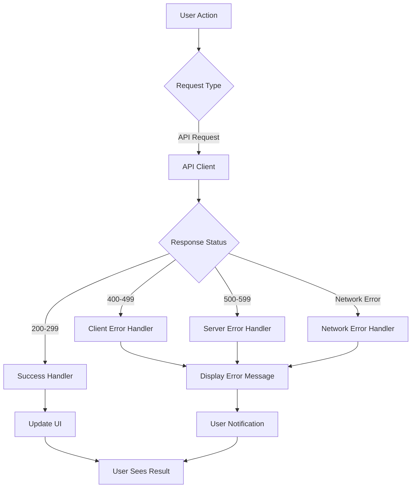

## System Integration Points

### Frontend Integration Points

1. **Authentication API**: `/api/auth/*`

   - Login, register, logout
   - Cookie management
   - User context updates

2. **Book API**: `/api/books`

   - Search and browse
   - Librarian CRUD operations
   - Availability updates

3. **Borrow API**: `/api/borrow`

   - Borrow and return operations
   - Transaction history
   - Fee information

4. **User API**: `/api/users`

   - Profile management
   - Self-service updates
   - Borrowed count

5. **Librarian API**: `/api/librarians/*`

   - User management
   - All transactions view
   - Dashboard statistics

6. **Payment API**: `/api/payments/*`
   - Payment intent creation
   - Payment verification
   - Webhook handling

### Backend Integration Points

1. **Database**: MySQL via Sequelize ORM

   - All data persistence
   - Transaction management
   - Query optimization

2. **Stripe API**: Payment processing

   - Checkout session creation
   - Payment verification
   - Webhook event handling

3. **External Services**: (Future)
   - Email service for notifications
   - SMS service for alerts
   - File storage for documents

## Deployment Architecture

### Development Environment

```
Frontend (Vite Dev Server) → http://localhost:5173
Backend (Node.js) → http://localhost:3004
Database (MySQL) → localhost:3306
```

### Production Environment

```
Frontend (Static Build) → CDN/Web Server
Backend (Node.js) → Application Server
Database (MySQL) → Database Server
Stripe → External Payment Gateway
```

## Summary

The Library Management System follows a modern, layered architecture:

1. **Frontend**: React-based SPA with component-based architecture
2. **Backend**: Express.js REST API with MVC pattern
3. **Database**: MySQL with Sequelize ORM
4. **Integration**: Cookie-based authentication, Stripe payments
5. **Patterns**: Factory, Singleton, Observer, Decorator patterns
6. **Security**: HttpOnly cookies, role-based access, input validation
7. **Performance**: Code splitting, query optimization, caching

The system provides a complete, secure, and scalable solution for library management with clear separation of concerns and maintainable code structure.
